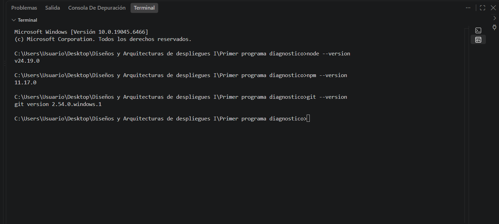
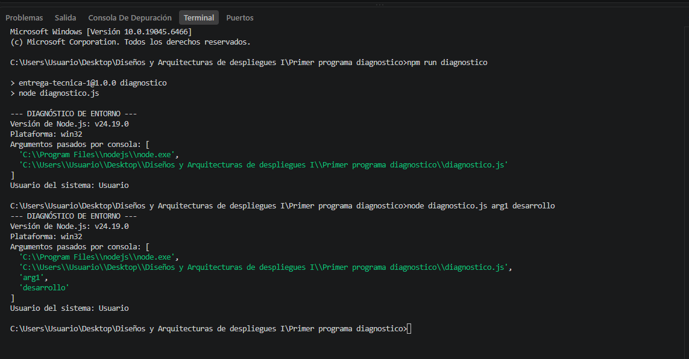

# Trabajos Técnicos - Diseño y Arquitectura de Despliegue I

**Alumno:** Teo Rojas

**Profesor:** Christian Lucas Di Guardia

---

## Entrega Técnica 1 - Diagnóstico de entorno

Script en Node.js que informa datos básicos del entorno de ejecución...

# Entrega Técnica 1 - Diagnóstico de entorno

Script en Node.js que informa datos básicos del entorno de ejecución: 
versión de Node, plataforma del sistema operativo, argumentos pasados 
por consola y el usuario del sistema.

## Verificación del entorno

Antes de empezar, verifiqué que las herramientas necesarias estuvieran instaladas:

node --version
v24.19.0

npm --version
11.17.0

git --version
git version 2.54.0.windows.1

 

## Cómo ejecutarlo

Con Node directamente:

node diagnostico.js


O usando el script definido en `package.json`:

npm run diagnostico


También se le pueden pasar argumentos extra, por ejemplo:

node diagnostico.js arg1 desarrollo

## Qué hace cada línea

```javascript
console.log("--- DIAGNÓSTICO DE ENTORNO ---");
console.log("Versión de Node.js:", process.version);
console.log("Plataforma:", process.platform);
console.log("Argumentos pasados por consola:", process.argv);
console.log("Usuario del sistema:", process.env.USER || process.env.USERNAME);
```

- **`console.log(...)`**: imprime texto en la terminal.
- **`process.version`**: devuelve la versión de Node.js instalada.
- **`process.platform`**: devuelve el sistema operativo (`win32`, `linux`, `darwin`).
- **`process.argv`**: array con la ruta de node, la ruta del script y los argumentos extra pasados por consola.
- **`process.env.USER || process.env.USERNAME`**: lee la variable de entorno del usuario. Uso `||` porque `USER` existe en Linux/Mac pero no en Windows, donde la variable se llama `USERNAME`.

## Aprendizajes
Lo que más me costó fue entender que `process.env.USER` no funciona en Windows, 
porque esa variable es propia de sistemas Unix (Linux/Mac). Tuve que investigar 
y usar `process.env.USER || process.env.USERNAME` para que el script funcione 
sin importar el sistema operativo donde se ejecute.

## Evidencia de ejecución
 
